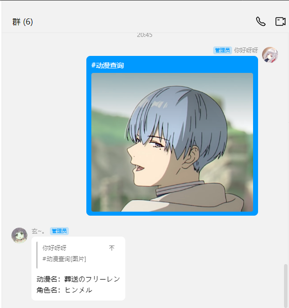
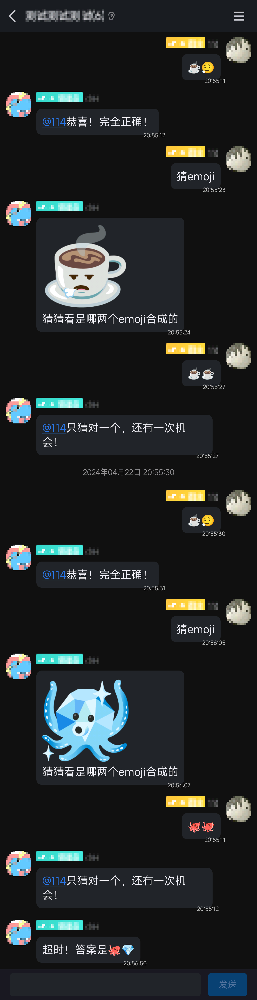

# 红色问答的动漫查询插件

[红色问答](https://github.com/super1207/redreply)的插件，用于根据动漫图片，查询动漫信息。

发送`#动漫查询` + 一张动漫人物图片，可以识别出动漫名和动漫人物，如图：

某些不支持混合消息的平台，可以这样发送：

如果`#动漫查询`查不出来，可以试试`#游戏查询`。

感谢：https://ai.animedb.cn 提供接口